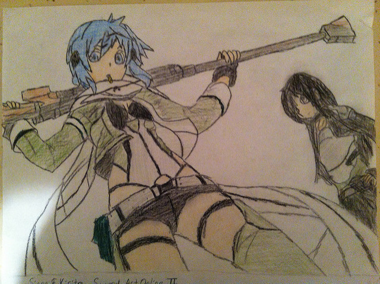

 <small>   <i>Little fog at the gate</i> by David Yu (2017) is licensed under <a href="https://creativecommons.org/publicdomain/zero/1.0/legalcode">CC0 1.0</a>   </small>

Portfolio of data displays
==========================

Thomas Ryan
2019-05-03

Introduction
------------

A portfolio documents your professional growth and competence by providing tangible evidence of your knowledge and skills in data visualization and visual rhetoric. The introduction is the reader's first glimpse of your work; give them a reason to keep reading.

Displays and critiques
----------------------

[Display 1](reports/d1.md) Distribution of US trade of goods with Other countries, 2018
This box plot shows the balance of trade between the US and all the countries it trades with.

[Display 2](reports/d2.md) San Fracisco Police Incidents by Time of Day, 2018
This multiway dot plot shows the number of several types of police recorded incidents seperated into four parts of the day (Morning, Afternoon, Evening, Night).

[Display 3](reports/d3.md) Comparison of Small-Scale propeller Brands
This group of scatterplots shows the difference in thrust efficiency between several propellers with similar specifications across various brands.

[Display 4](reports/d4.md) Death by Air Pollution in the United States Compared with the World
These line graphs show death by different varietie of air pollution over the last aproximatly 20 years in the US. They are compared with similar deaths in the rest of the world. There is both a classical (and unethical) display included, and a sensitive and ethical one.

[Display 5](reports/d5.md) Telecom Donations Have little effect on senate vote compared with party
This strip plot is a resign of a bar chart that better shows the relationship between part, donation, and vote in a ruling on an FCC privacy rule.

[Display 6](reports/d6.md) Title of your graph
State the type of graph (co-plot, scatterplot matrix, or parallel coordinate plot) and summarize the main points of the report.

[Display 7](reports/d7.md) Title of your graph
State the type of graph (cycle plot, financial plot, diverging stacked bar, etc.) and summarize the main points of the report.

Discussion notes
----------------

[Reading responses](reports/reading-responses.md)

[Reflections on rhetoric](reports/video-reflection-1.md)

[Presentation prompts](reports/presentation-prompts.md)

[Correspondance](reports/correspondence.md)
