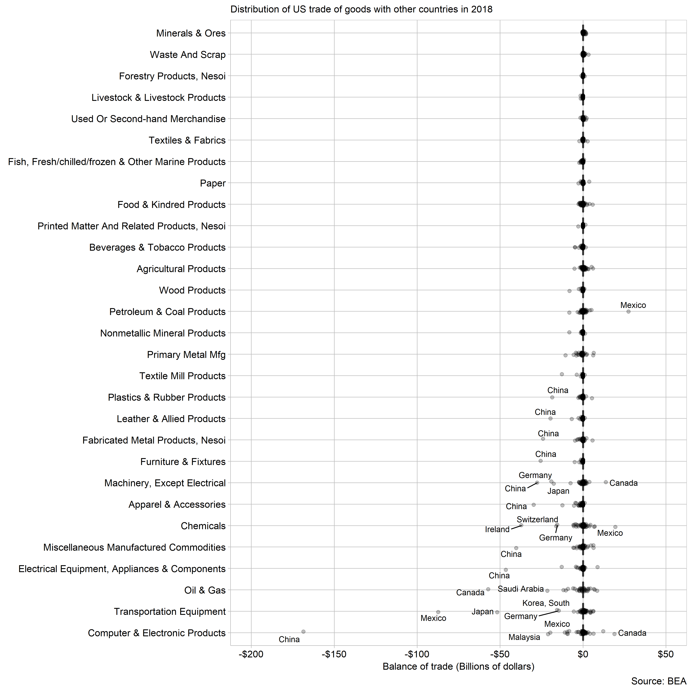

 <small>   <i>d1, strip plot</i>   </small>

Portfolio of data displays
==========================

Thomas Ryan
2019-03-29

Introduction
------------

A portfolio documents your professional growth and competence by providing tangible evidence of your knowledge and skills in data visualization and visual rhetoric. The introduction is the reader's first glimpse of your work; give them a reason to keep reading.

Displays and critiques
----------------------

[Display 1](reports/d1.md) Title of your graph
State the type of graph (strip plot or box plot) and summarize the main points of the report.

[Display 2](reports/d2.md) Title of your graph
State the type of graph (multiway dot plot) and summarize the main points of the report.

[Display 3](reports/d3.md) Title of your graph
State the type of graph (scatterplot) and summarize the main points of the report.

[Display 4](reports/d4.md) Title of your graph
State the type of graph (dot plot, line graph, or scatterplot) and summarize the main points of the report.

[Display 5](reports/d5.md) Title of your graph
State the type of graph (dot plot, line graph, or scatterplot) and summarize the main points of the report.

[Display 6](reports/d6.md) Title of your graph
State the type of graph (co-plot, scatterplot matrix, or parallel coordinate plot) and summarize the main points of the report.

[Display 7](reports/d7.md) Title of your graph
State the type of graph (cycle plot, financial plot, diverging stacked bar, etc.) and summarize the main points of the report.

Discussion notes
----------------

[Reading responses](reports/reading-responses.md)

[Presentation prompts](reports/presentation-prompts.md)

[Correspondance](reports/correspondence.md)
