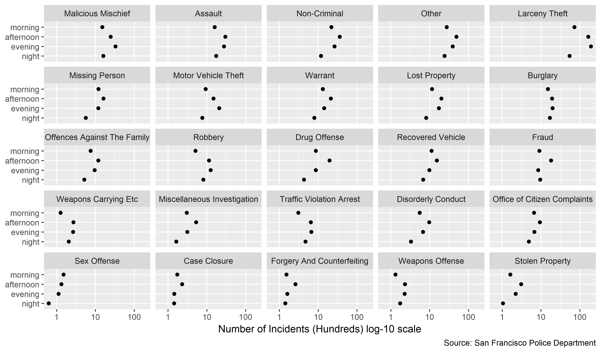

## San Fracisco Police Incidents by Time of Day, 2018
Requirements:  
 - 100 observations of Number of incidents  
 - 4 levels of Time of Day variable  
 - 25 levels of Incident Category variable  


Report:

The San Francisco Police department keeps a pubic record of all "Incidents" they deal with every year. They record the time and day of the incident, the type of incident, the location, and various other data. I have seen several graphics that use this data to build a map of where these incidents occur, but I have not seen one for when they occur. So I decided to split them into four levels: Morning, Afternoon, Evening, and Night to compare the number of incidents between different times of day, and among different types of incidents.

```{r, echo=FALSE, message=F, warning=F}
library("knitr")

```

There are 100 observations in the data, after removing all incidents with less than a median of 100 occurrences in the year (an unusual, but not meaningful, coincidence). To keep the number of hours in each part of the day the same I choose "Morning" to be 5:00--11:00, "afternoon" to be 11:00--17:00, "evening" to be 17:00--23:00, and "night" to be 23:00--5:00. 

The first key takeaway from this graph is that most types of crimes mostly happen in the afternoon, then the evening, followed by the morning, then the night. Another common pattern is that evening and afternoon are flipped, as with Criminal Mischief, Motor Vehicle Theft, and Robbery. A few standout cases are Burglary, which is fairly constant through the day. Fraud, which happens in the afternoon, and Sex Offenses, which happen disproportionately in the morning. While it can't be concluded from this graph that the night is actually the safest time (perhaps there are just less people out at night) it does allow relative comparisons between crimes at a given time of day.

This data lends itself to a multiway dot plot because the multiway dot plot is made for the comparison of a quantitative result for every combination of levels from the two categories. E.g. a number of incidents for every combination of time of day and type of incident.  

In terms of graph design there are several key choices that make this a good design. The size, and aspect ratio of the display, as well as the number of rows and columns were chosen for ease of comparison between data sets while not cluttering the labels or making the font too small. There are 5 columns and 5 rows because more than 5 becomes overly difficult to read [@Doumont:2009]. For more clarity, I put the incident types on the y-axis, making them easier to read [@Doumont:2009].

I created both this multiway and it's dual, with four panels and 25 data points in each panel, and found that this display better demonstrated the interaction between certain types of incidents and their frequency by time of day. To more easily compare between the panels I ordered the data by its median from the top right to the bottom left, and I maintained a constant scale and order of variables in each multiple so they can be easily compared [@Robbins:2013a]. 

Due to the spread of the number of incidents a log scale is required to see the shape of the low number of incident data. Because of this log-scale a length representation of this data, such as a set of bars, would not be appropriate. So instead I used a position representation (dots) [@Doumont:2009].

#references
<div id="refs"></div>
