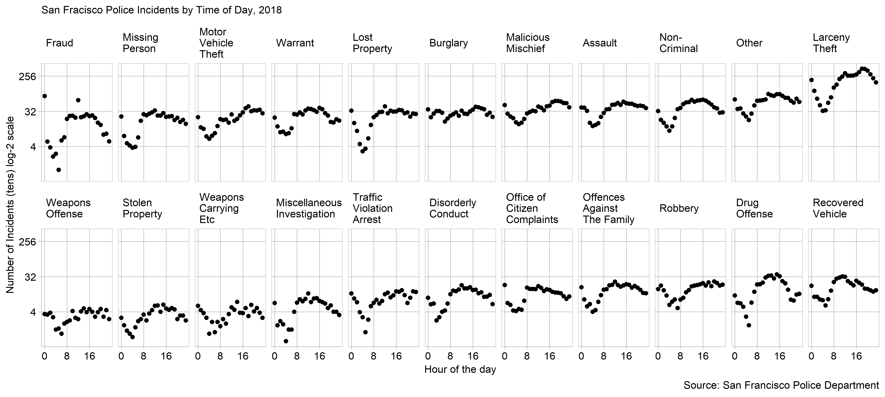

San Fracisco Police Incidents by Time of Day, 2018
--------------------------------------------------

The San Francisco Police department keeps a pubic record of all "incidents" they deal with every year. They record the time and day of the incident, the type of incident, the location, and various other data. I have seen several graphics that use this kind of data to build a map of where these incidents occur, but I have not seen one for when they occur. The display below shows the distribution of incidents throughout the day, separated by type of incident as recorded by the SFPD.

### Requirements

This display meets the data requirements for D2

-   528 observations
-   One quantitative variable (number of incidents)
-   Two categorical variables: category of incident (22 levels) and time of day (24 levels)

 The display show the number of incidents that happened in each hour, for example, the dot at 0:00 represents the number of incidents that happened between 0:00 and 1:00. The names of the are taken for the SFPD, who have specific definitions of each available, except "other" which is a combination of several similar SFPD "other"" categories.

The first key takeaway from this graph is that most types of crimes dip between 0:00 and 8:00, and peak between 8:00 and 16:00. A few interesting cases are Burglary, which is fairly constant through the day. Fraud, which happens in the afternoon, and Larceny Theft which peaks just after 16:00. While it can't be concluded from this graph that the late night / early morning is actually the safest time (perhaps there are just less people out at night) the display does allow relative comparisons between crimes at a given time of day.

This data lends itself to a multiway dot plot because the multiway dot plot is made for the comparison of a quantitative result for every combination of levels from the two categories. E.g. a number of incidents for every combination of time of day and type of incident.

In terms of graph design there are several key choices that make this a good design. The size, and aspect ratio of the display, as well as the number of rows and columns were chosen for ease of comparison between data sets while not cluttering the labels or making the font too small. There are 11 columns and 2 rows to make the slopes closer 45 degrees and make it easier to see trends \[@?\]. For more clarity, I put the incident types on the y-axis, making them easier to read (Doumont, [2009](#ref-Doumont:2009)). To more easily compare between the panels I ordered the data by its median from the top right to the bottom left, and I maintained a constant scale and order of variables in each multiple (Robbins, [2013](#ref-Robbins:2013a)). Due to the spread of the number of incidents a log scale is required to see the shape of the low number of incident data. Because of this log-scale a length representation of this data, such as a set of bars, would not be appropriate. So instead I used a position representation (dots) (Doumont, [2009](#ref-Doumont:2009)).

references
==========

Doumont J-l (2009) Designing the graph. *Trees, maps, and theorems: Effective communication for rational minds*. Principiae, Kraainem, Belgium, 133–143 <http://www.treesmapsandtheorems.com/>

Robbins N (2013) General principles for creating effective graphs. *Creating More Effective Graphs*. Chart House, Wayne, NJ, 154–225 <http://www.nbr-graphs.com/resources/recommended-books/>
