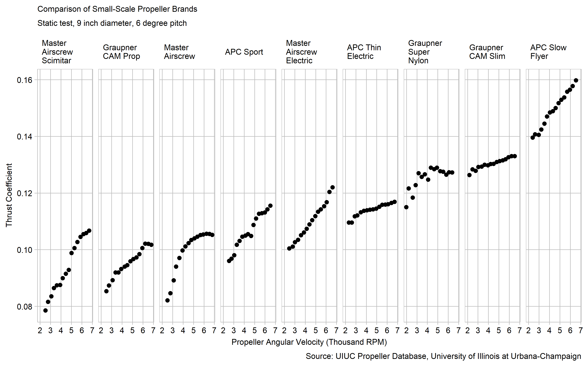

Comparison of Small-Scale propeller Brands
------------------------------------------

My senior design project is to make a model aircraft that fulfills the requirements of the Design Build Fly Competition. One of the most stringent requirements of the competition this year is that the aircraft needs to take off in 10 feet from a ramp. To accomplish this we needed to pay a great deal of attention to the propulsion system - The motor and propeller. In general we found that using performance data from real tests was the best way of predicting if a propulsion system would work; the results from the theoretical models we tried to use were too far off to be useful.

Fortunately there are significant collections of propeller performance data freely available online. The data for the graph below was collected from the University of Illinois at Urbana-Champaign Propeller Database, where it originally was taken from a MS thesis by John Brandt in 2008. I am interested in the propeller performance at takeoff, so the data I used in the display below is from static tests of each propeller - the propeller is held in place and only pulls still air (similar to a plane accelerating from a standstill, but not one in flight). Specifically, I am comparing the correlation between Thrust coefficient and rpm between propellers of different brands.

### Requirements

This display meets the data requirements for D1 distributions

-   144 observations
-   Two quantitative variable: Thrust coefficient and RPM
-   One categorical variables: brand (9 levels)

This display also meets the following document requirement

-   Technical data (1/2)

 Thrust Coefficient in the display is a nondimensionalized version of thrust that allows the relative efficiency of different propellers to be easily compared. In general when these small-scale propellers are sold their diameter and pitch angle are listed as the only specifications. Any other differences are communicated through the use of non-technical terms like "Sport" or "Slow fly". In the display above I compare propellers with the same diameter and pitch so that I can quantify the difference between propellers with these different marketing terms.

The main takeaway from the display is that there is a difference between these propellers. Some propellers produce much more static thrust than others. Not only that, but the amount of increased efficiency with RPM can vary dramatically. While the APC Slow Flyer benefits greatly with increased RPM, the Graupner Super Nylon is equally efficient at most RPMs. This has significant implications on motor choice. This display shows the benefit of choosing the right propeller for static thrust, however, It makes me ask what the costs are. The next step would be to look at the dynamic Tests to see if the propellers are trading dynamic for static performance.

A collection of scatterplots faceted on brand works well to display this data. There are two quantitative variables that I am looking for a correlation between, which is the purpose of the scatterplot. Faceting on the categorical variable makes sense because 9 is too many colors or shapes to keep track of on the same graph, and the different levels can still be easily compared even when faceted. When plotted on the same graphs some of the symbols or colors blend together, making the display look cluttered (Doumont, [2009](#ref-Doumont:2009)). Another reason I went with the Facet was to avoid having the audience memorize a legend (Wainer, [2014](#ref-Wainer:2014)). There are 9 columns in one row to make the slopes closer 45 degrees and make it easier to see trends.

In terms of graph design there are several key choices that make this a good design. The size, and aspect ratio of the display, as well as the number of rows and columns were chosen for ease of comparison between data sets while not cluttering the labels or making the font too small. I made the graph as small as I could without making the labels indistinguishable. This helps emphasize the data (Doumont, [2009](#ref-Doumont:2009)). I changed the x label from RPM to thousand RPM so they wouldn't write over each other.

To more easily compare between the panels I ordered the data by its mean from the top right to the bottom left (Knaflic, [2013](#ref-Knaflic:2013-09)). I also maintained a constant scale and order of variables in each multiple so they can be easily compared (Robbins, [2013](#ref-Robbins:2013a)).

### references

Doumont J-l (2009) Designing the graph. *Trees, maps, and theorems: Effective communication for rational minds*. Principiae, Kraainem, Belgium, 133–143 <http://www.treesmapsandtheorems.com/>

Knaflic CN (2013) Logic in order. <http://tinyurl.com/yxf8gspl>

Robbins N (2013) General principles for creating effective graphs. *Creating More Effective Graphs*. Chart House, Wayne, NJ, 154–225 <http://www.nbr-graphs.com/resources/recommended-books/>

Wainer H (2014) Fifteen displays about one thing. *Medical illuminations: Using evidence, visualization, and statistical thinking to improve healthcare*. Oxford University Press, Oxford, UK, 32–49
