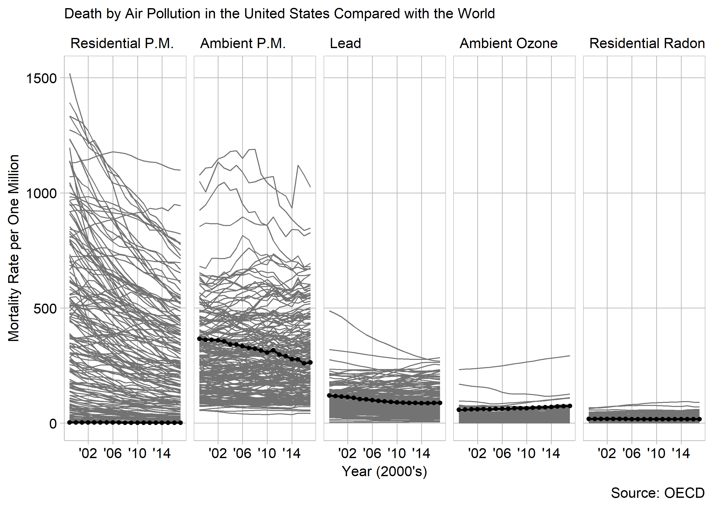

## Death by Air Pollution in the United States COmpared with the World

###Requirements  
 - 18525 Observations of mortality (20 req.)
 - air pollution mortality (injury or fatality req.)
 - 3 categorical: time, country, pollution type (one req.)
 
###Report

Unethical:
```{r, echo=FALSE, message=F, warning=F}
library("knitr")

```


Ethical:
```{r, echo=FALSE, message=F, warning=F}
library("knitr")
include_graphics("../figures/d4-pollutionMortality-2.png")
```


###references
<div id="refs"></div>
