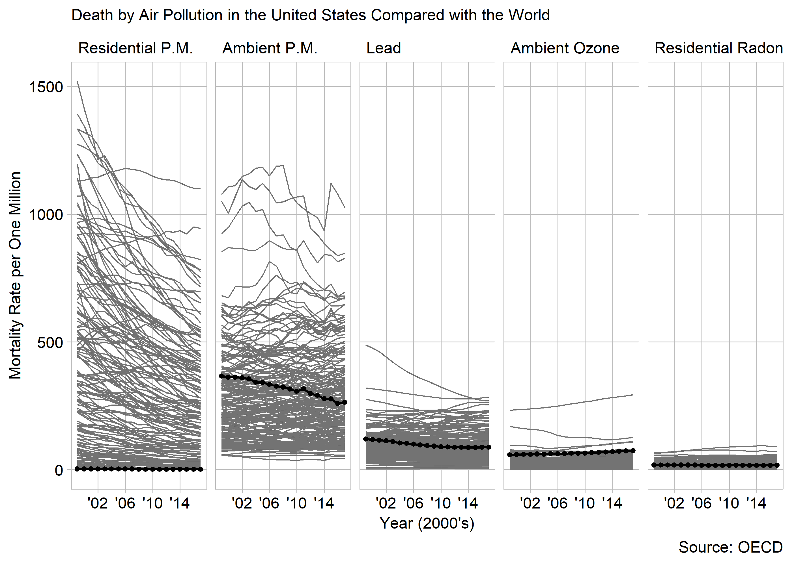

Death by Air Pollution in the United States Compared with the World
-------------------------------------------------------------------

This display is about the evolution over time of deaths caused by air pollution in the 18 years between 1999 and 2017. In addition the data has been split up by country, and type of air pollution, with country providing a backdrop to the US death rate. I have included both a traditional graph, and a newer style of graph which follows certain guidelines about presenting data with a human cost in an attempt to be sympathetic and ethical.

### Requirements

This display meets the data requirements for D4

-   18525 observations
-   about fatalities (death by air pollution)
-   Two quantitative variables: number of deaths and year
-   Two categorical variables: pollution type (5 levels) and country (195 levels)

Unethical:  This is the traditional graph, it is a linegraph which suits the timeseries data. Using lines allowing trends to be seen; if the lines were dots they would all blend together. The black line is the US line, while the other line are 194 othe countries recorded by the OECD.

One of the interesting things in this graph is the variation in where the US does well and where it doues poorly. While the US has very few deaths from Residential Particulate MAtter, it is in the middle of the pack for Ambient Particulate Matter. Lead it is in the middle, Ozone is quite bade, and Residential Radon is very low. One other interesting trend that can be seen is that for all pollution types except ambient ozone the general trend (and the US trend) is either down or constant. What is going on with the Ozone?

There were several design choices I made to make this graph more easilu read. I maintained a constant scale and order of variables in each facet so they can be easily compared (Robbins, [2013](#ref-Robbins:2013a)). I ordered the data by its mean, going from highest to lowest. This grouping of categories makes it easier to pick out discrepencies between the data sets (Knaflic, [2013](#ref-Knaflic:2013-09)). I made the graph as small as I could without making the labels indistinguishable. This helps emphasize the data (Doumont, [2009](#ref-Doumont:2009)). I went with a facet (rather than colors to distinguish categories) to avoid having the audience memorize a legend (Wainer, [2014](#ref-Wainer:2014))

This graph could be considerd to be unethical. According to Voss and Dragga the lack of "humanizing" features that demonstrate the human suffering that results from the pollution makes the graph unethical (Dragga and Voss, [2001](#ref-Dragga+Voss:2001)). If someone who was a victim of disease from pollution came across this graph they might hypothetically be hurt or offended by it.

Ethical: 

The goal of adding the text and dot plot to the right was to humanize the data, and thus make the display ethical (Dragga and Voss, [2001](#ref-Dragga+Voss:2001)). The dot plot shows how the air pollution kills, which makes the human suffering implied by the main display more specific. The paragraph from the COPD Foundation disucusses possible effects and symtoms of COPD, further reinforcing the human cost the the pollution.

### references

Doumont J-l (2009) Designing the graph. *Trees, maps, and theorems: Effective communication for rational minds*. Principiae, Kraainem, Belgium, 133–143 <http://www.treesmapsandtheorems.com/>

Dragga S and Voss D (2001) Cruel pies: The inhumanity of technical illustrations. *Technical Communication* **48**(3), 265–274

Knaflic CN (2013) Logic in order. <http://tinyurl.com/yxf8gspl>

Robbins N (2013) General principles for creating effective graphs. *Creating More Effective Graphs*. Chart House, Wayne, NJ, 154–225 <http://www.nbr-graphs.com/resources/recommended-books/>

Wainer H (2014) Fifteen displays about one thing. *Medical illuminations: Using evidence, visualization, and statistical thinking to improve healthcare*. Oxford University Press, Oxford, UK, 32–49
