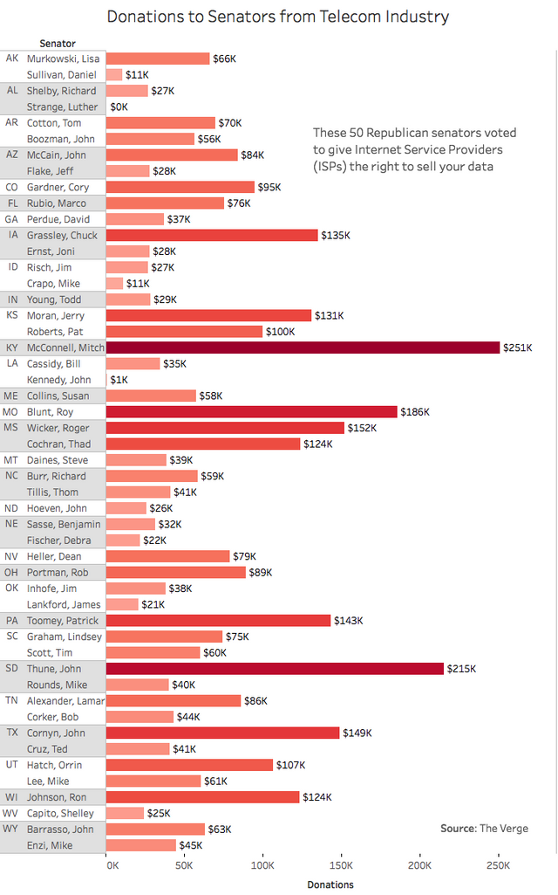

## Redesigning a misleading political graph

The subreddit r/dataisbeautiful is the forum on reddit dedicated to data visualization. Unfortunately due to the popularity contest nature of the subreddit occasionally displays that are pandering and misleading are highly ranked. The following is one such graph, which panders to the left wing / any-lobbying crowd.

###Requirements  

This display meets the data requirements for D5

- 100 observations
- redesign of misleading graph
- One quantitative variables: number of senators who voted
- Two categorical variables: Party of Senator (3 levels) and vote yea or nay (2 levels)  

```{r, echo=FALSE, message=F, warning=F}
library("knitr")

```

This graph is flawed in several ways. In order to pander to a specific audience it limits the data shown to one political party and one voting pattern. It suggests a correlation (between money donated and voting yes) where there is none (when the full context is included). Without anything to compare the raw numbers against the data that is displayed is meaningless.  
Beyond being misleading it is also poorly made. The bar chart is a poor choice, and the bars are not ordered by the data.

I have made several alterations to improve the display:

```{r, echo=FALSE, message=F, warning=F}
library("knitr")
include_graphics("../figures/d5-telecomSenate.png")
```

A dot plot is suitable for this display because I want to compare one quantitative variable across multiple categories, which is what a dot plot is made for and 100 observations is small enough that a box and whisker plot might obscure more than it would clarify.

I included all the data from the vote, to provide context a make the graph less misleading[@Wainer:2000:Ch.1]. Now that this display is in a more clear form it is obvious that the senators had the same distributions of telecom donations regardless of party. Instead they voted on party lines with the donations having seemingly no effect. 

I made several design choices to make this graph clear and effective. I jittered the data and made them translucent so that they can all be seen. [@Robbins:2013a]. I directly labeled the points so the viewer doesn't need to memorize a legend [@Wainer:2014]. I colored the data by convention, to match what a viewer would expect. 

references
<div id="refs"></div>


