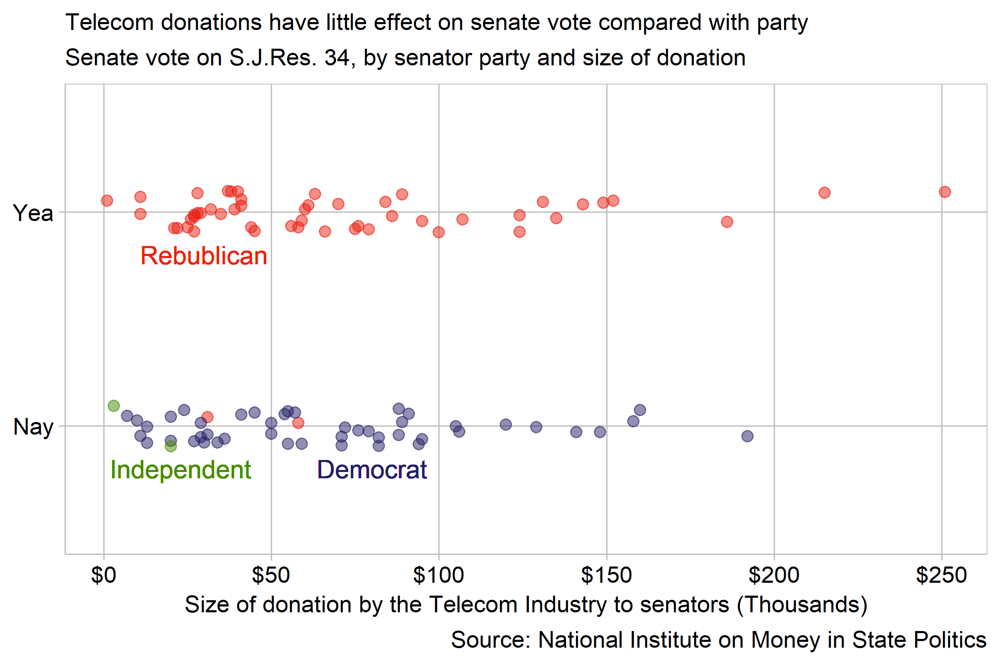

## Redesigning a misleading political graph

###Requirements  
 - 100 Observations of votes (20 req.)
 - 1 quantitative variable: donation amount (1 req.)

###Report

```{r, echo=FALSE, message=F, warning=F}
library("knitr")

```

```{r, echo=FALSE, message=F, warning=F}
library("knitr")

```


###references
<div id="refs"></div>
