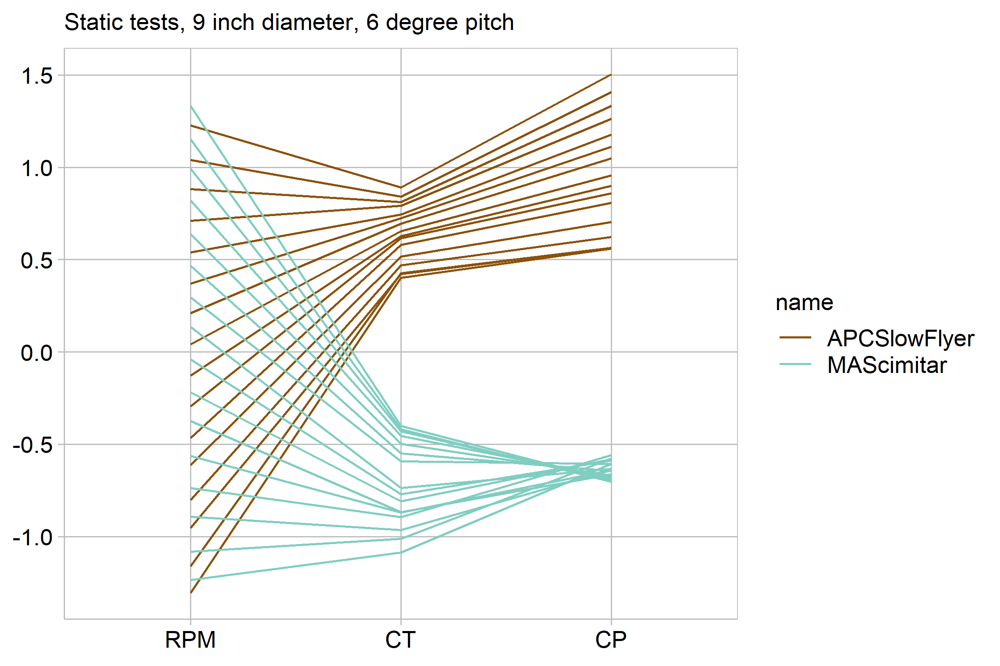
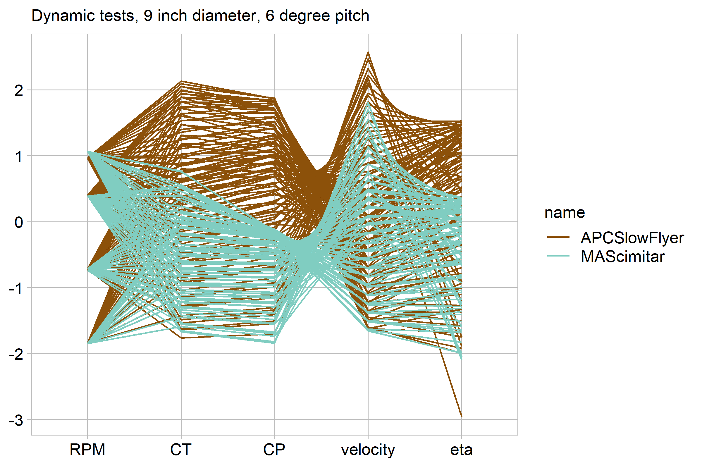

## Comparison of Small-Scale propeller Brands 2

This graph expands on d3, so read that before this one. The follwing displays use several of the test results availible to compare the best and worst performing brand from d3 in a static, but also dynamic test. The first display mostly contains the information in the d3 display for the two propellers, but the second has the dynamic test results.

### Requirements 

This display (the second one) meets the data requirements for D6  

- 244 observations 
- Five quantitative variable: Thrust coefficient, rpm, power coefficient, efficiency, and velocity
- Two categorical variables: brand (9 levels) and test typw (two levels)

This display also meets the following document requirement 

- Technical data (2/2)

```{r, echo=FALSE, message=F, warning=F}
library("knitr")

```

```{r, echo=FALSE, message=F, warning=F}
library("knitr")

```

Power coefficient, like thrust coefficient, in the display is a nondimensionalized version of power that allows the relative efficiency of different propellers to be easily compared, and eta is an overall efficiency. 

The main takeaway from the display is that there is a difference between these propellers in both dynamic and static testing. In general, however, it appears that one of the propellers is better than the other in most situations. While both have similar lower bounds on CT and eta, the APC Slow Flyer can get a much higher thrust coefficient and efficiency. This seems strange to me and makes me wonder if I've missed some key shortcoming of the Slow Flyer.

A parellel coordinate plot is suited for this data because I have many quantitative variables, with a couple categorical. The pwrallel coordinate plot is one of the few that can accomidate this many quantitative variables. In addition the comparison is more important than the correlation between the variables for me, so the loss of fidelity on the correlations is not a big problem.

To make this display information dense, readible, and accesible I made several design choices. The color pallete was choosen to be high contrast, and print and colorblind freindly. The aspect ratio was choosen to make the slopes closer 45 degrees (on average) and make it easier to see trends. I made the graph as small as I could without making the labels indistinguishable. This helps emphasize the data [@Doumont:2009].


###references
<div id="refs"></div>