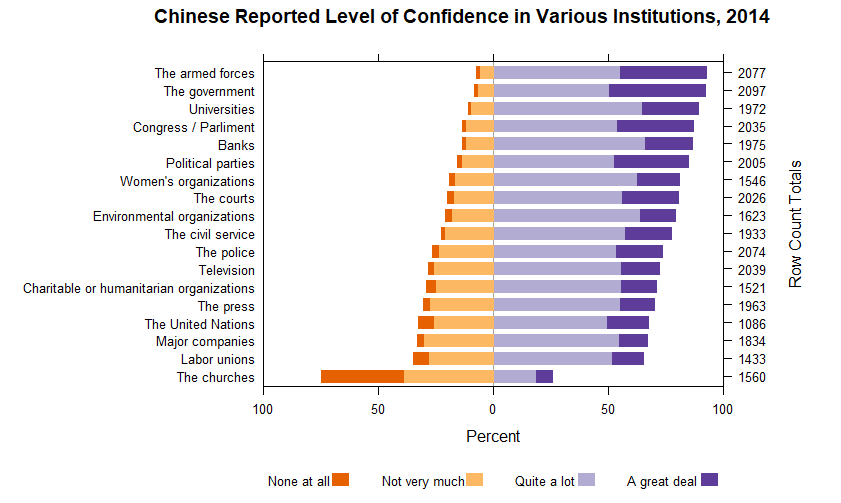

## Reported level of confidence in institutions, by country, 2014

This display show peoples reported level of confidence in various institutions such as the government, churches, and charitable organizations, separated by country. The data comes from the World Values Survey.

### Requirements 

This display meets the data requirements for D7 diverging stacked bar

- 2232 observations 
- One quantitative variable: number of people with confidence level
- Two categorical variables: confidence level (4 levels), group (18 levels), and country (3 levels)

This display also meets the following document requirement 

```{r, echo=FALSE, message=F, warning=F}
library("knitr")
include_graphics("../figures/d7-InstitutionalConfidence-1.png")
```
```{r, echo=FALSE, message=F, warning=F}
library("knitr")
include_graphics("../figures/d7-InstitutionalConfidence-2.png")
```
```{r, echo=FALSE, message=F, warning=F}
library("knitr")

```
The display above shows level of confidence in four categories, with the length of each bar representing the percentage of people who gave a certain response. The left of the zero is negative responses, while the right is positive.

The main takeaway from these graphs is that in the US people mostly have a low level of confidence in these institutions. The only groups with a significant positive margin are The armed forces, police, universities, charitable organizations, churches, and the courts. On the other hand in China people are very confident in most institutions, especially government ones, except for the churches, which is the only group with a more negative than positive response. Germany provide an interesting contrast with the US, overall matching what might be expected. Confidence in churches and the armed forces is much less, confidence in labor unions is much higher.

Because my data is Likert style survey data (frequency of each response to survey questions where each response can be only one of a set of possible answers) It is perfect for the diverging stacked bar

In terms of design choices there are a few particularly important ones I made. To more easily compare between the panels I ordered the data by its mean from the top right to the bottom left [@Knaflic:2013-09].  I made the graph as small as I could without making the labels indistinguishable. This helps emphasize the data [@Doumont:2009]. The colors were chosen with the online tool "Color Brewer" by  Cynthia Brewer, and Mark Harrowe to be color blind, printer, and photocopier safe.


###references
<div id="refs"></div>